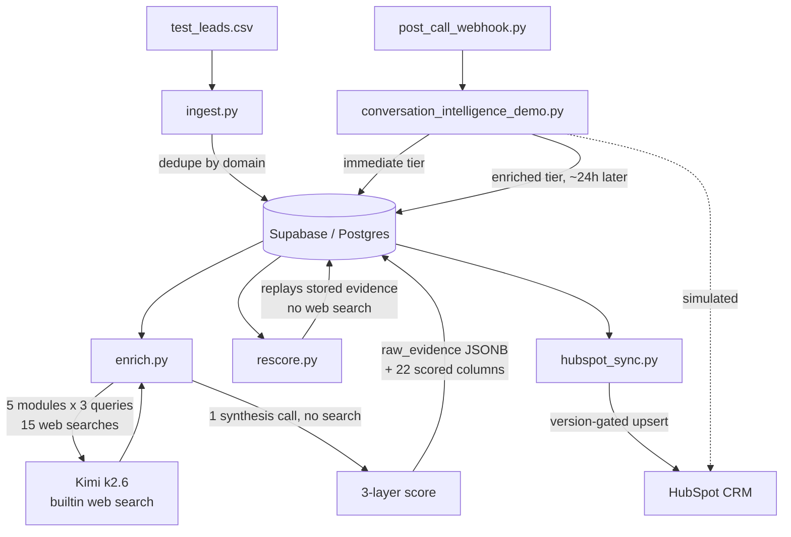

# GTM Enrichment Engine

Signal-based account intelligence and call analysis, built on Postgres, an LLM
with built-in web search, and HubSpot.

This was built end to end as a working system for a GTM Systems Engineer
application at Omnea, a procurement orchestration platform. It is shared as
written rather than rebranded, so the scoring model, prompts and competitive
routing rules are still expressed in terms of Omnea's ICP. Read those as a
worked example of encoding a specific go-to-market thesis into a pipeline, not
as a general-purpose enrichment tool.

## The problem

An SDR working a list of a few hundred accounts has no cheap way to tell which
of them are actually worth a first touch. The signals that matter for
procurement software — whether a company already runs a procurement tool, whether
it is hiring into the function, whether it recently raised, whether a new CFO
just arrived — are all public, but assembling them per account takes 20 to 30
minutes of manual research, and the result lives in a doc nobody reads again.
Per-credit enrichment vendors sell firmographics rather than these signals, and
their scores are opaque. This pipeline ingests a list of domains, runs
structured web research against each one, scores fit and timing against a
weighted model that a RevOps person can tune from a database table, and writes
the result into HubSpot where the SDR already works. A second module does the
equivalent for call transcripts: analyse the call against everything already
known about the account, and write the analysis back rather than leaving it in a
chat window.

## Architecture



Postgres is the source of truth. Raw research evidence is stored as JSONB
alongside the scores, which means the scoring model can be changed and replayed
over existing evidence without paying for the searches again. HubSpot only ever
receives final structured output — the fields an SDR acts on.

### Files

| File | Role |
| --- | --- |
| `ingest.py` | CSV to Postgres. Normalises names and domains, dedupes companies by domain and contacts by email or name. |
| `enrich.py` | The expensive path. Five search modules per company, then one synthesis call that produces the score. |
| `rescore.py` | Replays stored `raw_evidence` through the current scoring prompt. No web searches. Optionally backfills `territory_tag`. |
| `hubspot_sync.py` | Version-gated upsert into HubSpot, matching on domain to avoid duplicates. |
| `conversation_intelligence_demo.py` | End-to-end call analysis against a synthetic transcript. Also holds the functions the webhook imports. |
| `post_call_webhook.py` | Flask entry point. Granola or Gong posts a finished call; runs the immediate tier and stores the record. |

### The enrichment flow

`enrich.py` selects companies where `enrichment_version < 2`, then for each one
runs five search modules — company profile, procurement stack, decision makers,
jobs, news triggers — of three queries each. Every query is a separate call to
Kimi with the `$web_search` builtin attached, returning a small JSON object
holding findings, a confidence label, and key facts. Those fifteen results are
accumulated into an evidence dictionary, which is then passed in a single
synthesis call along with the active weight table and the scoring rubric. The
synthesis response is written to roughly twenty-two columns plus the full
evidence blob as JSONB.

The tool-calling loop in `kimi_web_search` is worth reading if you are reviewing
this, because one line looks wrong and is not. Moonshot's `$web_search` is a
`builtin_function`: the model emits a tool call, the server runs the search
itself, and the client's only obligation is to acknowledge the call by echoing
the arguments straight back as the tool result. So `tool_result =
tool_call_arguments` is the documented contract rather than an unimplemented
stub. Similarly, `reasoning_content` has to be round-tripped onto the assistant
turn or the follow-up request is rejected. Both are commented in place.

The synthesis call deliberately does not attach the search tool. It reasons over
evidence already gathered, and leaving the tool attached let the model fire
additional billable searches it did not need.

## Three-layer scoring, and what actually computes it

Read this section before drawing conclusions about the rest — the gap between
the model as described and the model as implemented is the most important thing
to know about this codebase.

The scoring model has three layers.

**Layer 1, hard filters.** SAP Ariba deployed, under 200 employees, or
government/non-profit each cap the score at 20. Ariba is treated as a
disqualifier because it is deeply embedded and displacing it is not a realistic
motion. Coupa and Zip are explicitly *not* disqualifiers — they set
`competitive_routing` instead, because Zip is a rip-and-replace opportunity and
Coupa is a longer play. Routing them rather than filtering them is the one piece
of domain judgement in the model I would defend hardest.

**Layer 2, weighted signals.** Six signals scored 0-100 and combined against a
weight table: no procurement tool (25), procurement hiring (20), headcount
growth (15), recent funding (15), finance/COO hiring (15), global or regulated
complexity (10). The weights live in a `scoring_weights` table with an
`is_active` flag, so they can be changed without a deploy.

**Layer 3, timing multiplier.** Between 0.85 and 1.15, driven by whether a new
CFO or COO has arrived, whether the company raised recently, whether it is
hiring into ops now, or whether there are layoff signals.

Here is the part the previous version of this README got wrong. **None of that
arithmetic is performed in Python.** The weight table is read from Postgres and
interpolated into the prompt as text. The rubric above is prose in the same
prompt. The model returns `raw_score`, `timing_multiplier` and `icp_score` as
fields in its JSON response, and `save_enrichment` writes them to the database
unchanged. Nothing recomputes the weighted sum, checks that the breakdown sums
to the raw score, verifies the multiplier falls in the stated range, or asserts
that the hard-filter cap was applied when a hard filter fired.

So the three-layer model is a specification the model is asked to follow, not an
algorithm the code executes. In practice it follows it fairly closely, but two
runs over byte-identical evidence can and do produce different scores, and
nothing in the system would detect that. The weight table being configurable
makes this worse rather than better, because it creates the appearance of a
tunable model whose tuning is advisory. This is the first thing I would fix and
it is described concretely under limitations.

## Sync and versioning

Two integer columns implement the sync watermark. `enrichment_version` is what
Postgres holds; `last_synced_version` is what HubSpot last received.

```sql
SELECT * FROM companies
WHERE enrichment_version >= 2
  AND (
    hubspot_synced = false
    OR hubspot_synced IS NULL
    OR last_synced_version < enrichment_version
  )
```

`rescore.py` increments `enrichment_version` and sets `hubspot_synced = false`,
so rescored records are picked up by the next sync automatically. Within
`sync_company_to_hubspot`, the HubSpot write happens before the Postgres version
bump, so a crash between the two causes a harmless re-sync on the next run
rather than a silent divergence. Combined with matching on domain before
deciding create-versus-update, the sync is at-least-once against an idempotent
upsert.

One correction to an earlier claim. This does **not** let you tell which scoring
model a given HubSpot record reflects. `enrichment_version` is a run counter, not
a model identifier: `rescore.py` increments it on every run whether or not the
weights changed, so after three rescores with identical weights every record
sits at version 5 and the number tells you how many times the job ran, nothing
more. The weight set actually used is stored in Supabase inside
`icp_score_breakdown.weights_used`, but it is never synced to HubSpot and no
`scoring_weights` row id is recorded anywhere. Tying the version to the weight
configuration is a small schema change and would make the audit story real.

## Conversation intelligence

The second module analyses call transcripts in two tiers.

```
Granola / Gong webhook  ->  post_call_webhook.py
                                   |
                          resolve account by domain
                          (ICP score, routing, territory,
                           prior call records from Postgres)
                                   |
                        immediate tier - fires on receipt
                        (outcome, commitments, champion,
                         next step; what happened)
                                   |
                            store to call_records
                                   |
                    [~24h delay, an n8n node in production]
                                   |
                        enriched tier - full account context
                        (pain points, objections, deal stage,
                         risk signals, coaching; what it means)
                                   |
                          write back to HubSpot / Notion
```

Splitting the tiers is a latency decision. A rep needs a next step within hours
of a call, and that does not require deep reasoning over account history. The
expensive, context-heavy pass can wait a day, by which point it can also see
whatever else happened on the account.

The context assembly step is what makes the enriched tier worth running: it
loads the ICP score, competitive routing, territory, and previous call records
before the model reads a word of the transcript, so the analysis is grounded in
what is already known about the account rather than starting cold.

The transcript in `conversation_intelligence_demo.py` is entirely synthetic.
Contoso is a fictional company on the reserved `example.com` domain, and every
person, figure and vendor relationship in it is invented. It is labelled as such
in the file.

The current implementation calls Kimi k2.6 throughout. For nuanced call analysis
I would use Claude in production; the module is written against the OpenAI SDK
surface, so this is a client and model-name change rather than a rewrite.

## Why Python, not n8n

n8n excels at: event routing, webhook handling, scheduling, and simple API
connections. It is an orchestration tool.

It is not suited for: multi-step data transformation with business logic,
stateful processing, complex scoring models with configurable weights, retry
logic with exponential backoff, or anything that benefits from unit testing and
version control.

This pipeline contains a rate limiter class, exponential backoff on 429s,
multi-step tool call handling, JSONB transformations, version comparison logic,
competitive routing rules, configurable weight tables, and a synthesis layer
feeding back into scoring. None of that belongs in a visual workflow tool.

The correct separation of concerns:

- n8n decides when to run: triggers, scheduling, routing, alerting.
- Python decides what to do: business logic, scoring, analysis.
- Postgres is the source of truth: persistence, audit trail.
- HubSpot is the activation layer: what reps see.

The scripts were built and validated locally first. Deploying half-working logic
into n8n creates debugging hell. Code first, orchestration second.

## Design decisions

**Storing raw evidence rather than just scores.** The alternative was to keep
only the final scored columns and re-run research whenever the model changed.
Storing the full evidence blob as JSONB costs a column and makes `rescore.py`
possible: iterate on the scoring prompt across the whole table at zero search
cost. Given that research is roughly 95% of the per-company cost and the scoring
model is the part most likely to change, this is the decision that makes the
system maintainable, and I would make it again without hesitating.

**Prompt-enforced JSON rather than a schema.** The alternative was a JSON Schema
or a Pydantic model, with `response_format` set and validation errors fed back
for repair. What is implemented instead is a literal JSON template in the prompt,
an instruction to return JSON only, markdown-fence stripping, `json.loads`, and
`.get()` with defaults on the way to the database. This won on speed of
iteration during a short build, and it worked well enough that the cost stayed
invisible. It is the weakest decision in the codebase. The honest reason it
survives is that fixing it properly means moving the scoring arithmetic into
Python at the same time, which was out of scope for the build window rather than
technically hard.

**A fixed-interval client-side rate limiter plus backoff on 429.** The
alternatives were a token bucket, or a library like `tenacity` with typed
exception handling and jitter. What is implemented is a minimum-interval gate at
20 requests per minute and a three-attempt `3 * 2**attempt` backoff triggered by
substring-matching `"429"` or `"rate_limit"` in the exception text. Minimum
interval was chosen over a bucket because bursting has no value here — the work
is a long serial batch, so smoothing is strictly better than bursting, and it is
ten lines with no dependency. String-matching the status code was a shortcut, not
a decision, and the OpenAI SDK raises a typed `RateLimitError` that should be
caught instead.

**An integer watermark for sync state.** The alternatives were comparing
timestamps (`updated_at > hubspot_synced_at`) or hashing the payload to detect
real changes. Timestamps are vulnerable to clock skew between the application and
the database and make "has this actually changed" ambiguous when a write touches
`updated_at` without changing content. Hashing is the most correct option and
would suppress no-op syncs entirely, but requires storing and comparing a digest.
The integer watermark is monotonic, trivially expressible in the SQL predicate,
and makes "mark this dirty" a single assignment. Its weakness is described
above: it tracks runs rather than model generations.

**Kimi with a built-in search tool rather than a search API plus a scraper.**
The alternative was Serper or Brave for results plus something to fetch and parse
pages, then a separate summarisation call. Using a model with server-side search
collapses three components into one call and removes all the scraping and
robots.txt handling. The cost is that the search itself is a black box: there are
no URLs in the response, so nothing is independently verifiable, and every
finding is only as good as the model's willingness to say it did not find
anything. For a research pipeline whose output feeds a score, that is a real
trade rather than a free win.

**Five fixed search modules rather than an agent deciding what to look up.** A
free-running agent would adapt its research per company. Fixed modules make cost
per company predictable, make evidence comparable across companies, and make it
obvious which module produced a weak signal. The cost is that a company whose
relevant signal falls outside the five modules never gets it looked at.

## Known limitations and what I would change

These are ordered by how much they would matter at scale, and the first one is
the one I would fix before anything else.

**1. The scoring arithmetic lives in the prompt, not in Python.** As described
above, `raw_score`, `timing_multiplier` and `icp_score` are fields the model
emits and the database accepts. Two `rescore.py` runs over identical stored
evidence can diverge, and there is no assertion, test or invariant that would
notice. A weight change and model drift are indistinguishable from each other.
The fix is small: have the model emit only the six per-signal scores with their
reasoning, the hard-filter booleans, and the timing multiplier with its
justification — the judgement calls it is genuinely good at — then compute
`raw_score`, apply the cap, and derive `final_score` in Python. That is roughly
thirty lines, it makes scores reproducible, it makes the weight table load-bearing
rather than advisory, and it makes the whole model unit-testable. I did not do it
here because it was outside the scope I set for the build, not because it is
hard.

**2. There is no validation boundary between model output and the database.**
No schema, no type coercion, no range checks; `json.loads` followed by `.get()`
with defaults across twenty-two columns. A model that returns `icp_score` as a
string, omits `timing_multiplier`, or invents a `territory_tag` outside the
eleven allowed values will have that written to Postgres and then into a typed
HubSpot dropdown. Worse, the failure handling launders errors into data: when a
module query fails, `run_module_search` catches the exception and substitutes a
synthetic evidence object whose `findings` field contains the Python exception
string. That object is then serialised into the synthesis prompt and scored as
though it were research. A company whose searches failed and a company with
genuinely no signal are indistinguishable downstream, and both get a number.

**3. Retry coverage is narrow and the expensive path has no checkpoint.** Only
429 is retried, and it is detected by substring-matching the exception text. A
500, a read timeout, or a dropped connection kills the company outright with no
retry at all, and those dominate real-world failure. There is no jitter, so
parallel workers would synchronise their backoff, and `Retry-After` is ignored.
Separately, if the synthesis response fails to parse, the exception propagates to
`run_enrichment_v2`, the transaction rolls back, and all fifteen completed
searches for that company are discarded — the most expensive operation in the
system has the least protection. Evidence should be persisted as each module
completes, so synthesis can be retried independently of research.

**4. There are no tests.** For a system whose central artefact is a number that
drives sales prioritisation, that is the gap a reviewer should push on hardest.
The three I would write first, in order: (a) deterministic score computation —
given a fixed evidence fixture and a fixed weight table, assert an exact
`final_score`, which is only possible after fix 1 and is the main reason to do fix
1; (b) the parse layer — fenced JSON, double-fenced JSON, JSON with prose
wrapped around it, and truncated JSON, asserting the first three parse and the
fourth raises rather than silently degrading; (c) the sync predicate — insert
rows at various `enrichment_version` / `last_synced_version` / `hubspot_synced`
combinations and assert exactly the intended set comes back, since that query is
the thing standing between the pipeline and duplicate CRM writes.

**5. There is no eval set, so there is no way to tell a good weight
configuration from a bad one.** The `scoring_weights` table has an `is_active`
flag described as enabling A/B testing, but there is nothing to measure against.
No ground truth, no labelled accounts, no feedback loop from what actually
converted. Changing the weights changes the numbers, and whether that is an
improvement is currently a matter of opinion. The smallest useful version is
fifty accounts hand-labelled by someone who knows the ICP, held fixed, with rank
correlation reported on every scoring change. Without that, tunability is a
liability: it invites fiddling that feels like progress.

**6. Cost figures are estimates, not accounting.** `estimated_cost =
search_count * 0.005` is a flat assumed rate per search. Actual token usage is
returned on the completion object and is discarded. The roughly five cents per
company figure below, and every value written to `enrichment_log.cost_usd`, is
therefore an approximation of the right order of magnitude rather than a
measurement. Reading `completion.usage` and pricing it properly is a few lines.

**Also worth knowing, at scale.** The rate limiter is per-process in-memory
state, so running `enrich.py` and `rescore.py` concurrently doubles the effective
request rate against a single quota. Batch selection uses a plain `SELECT ...
LIMIT` with no row locking, so two workers would process the same companies —
`FOR UPDATE SKIP LOCKED` is the fix, and is a prerequisite for any parallelism.
`hubspot_sync.py` makes two API calls per company (a search then a write) with no
rate limiting or retry of its own, and HubSpot's search endpoint is more tightly
limited than its batch endpoints; the batch upsert API would cut this
substantially. `get_connection()` is copy-pasted into four files. Company name
disambiguation is unhandled, so similarly-named companies can contaminate each
other's research. B2C companies score low rather than triggering an explicit hard
filter. Ireland maps to `other` rather than `uk`.

## Setup

### 1. Install

```bash
git clone <repo> && cd GTM-enrichment-pipeline
python3 -m venv .venv && source .venv/bin/activate
pip install -r requirements.txt
```

### 2. Environment

Every module that talks to the LLM constructs its client at import time, so the
environment has to be populated before anything will even import. Create a
`.env` in the repo root:

```
SUPABASE_CONNECTION_STRING=postgresql://postgres:<password>@<host>:5432/postgres
KIMI_API_KEY=<moonshot-key>
HUBSPOT_ACCESS_TOKEN=<hubspot-private-app-token>
```

On IPv4-only networks use Supabase's Session Pooler connection string. The
direct connection is IPv6-only and will time out.

### 3. Schema

There is no migration tooling and no committed migration files — that is a real
gap, not an omission from these instructions. The DDL below is reconstructed
from the queries the code issues and is enough to run the pipeline end to end.

```sql
create extension if not exists pgcrypto;

create table companies (
  id uuid primary key default gen_random_uuid(),
  name text,
  domain text unique not null,
  website_description text,
  website_target_customer text,
  website_pain_points jsonb,
  website_tech_mentions jsonb,
  website_complexity_signals jsonb,
  procurement_stack_detected jsonb,
  procurement_maturity text,
  decision_makers jsonb,
  competitive_risk text,
  competitive_routing text default 'none',
  territory_tag text default 'other',
  hiring_procurement boolean default false,
  procurement_job_titles jsonb,
  procurement_job_count integer default 0,
  hiring_signal_strength text,
  news_buying_trigger boolean default false,
  news_buying_trigger_reason text,
  news_snippets jsonb,
  icp_score integer,
  icp_reasoning text,
  icp_score_breakdown jsonb,
  recommended_outreach_angle text,
  raw_evidence jsonb,
  enrichment_version integer default 0,
  website_enriched_at timestamptz,
  jobs_checked_at timestamptz,
  news_checked_at timestamptz,
  hubspot_company_id text,
  hubspot_synced boolean default false,
  hubspot_synced_at timestamptz,
  last_synced_version integer default 0,
  created_at timestamptz default now(),
  updated_at timestamptz default now()
);

create table contacts (
  id uuid primary key default gen_random_uuid(),
  company_id uuid references companies(id),
  first_name text,
  last_name text,
  email text,
  job_title text,
  created_at timestamptz default now()
);

create table call_records (
  id uuid primary key default gen_random_uuid(),
  company_id uuid references companies(id),
  contact_id uuid references contacts(id),
  hubspot_company_id text,
  granola_meeting_id text unique,
  call_date timestamptz,
  duration_seconds integer,
  rep_name text,
  territory text,
  transcript text,
  immediate_analysis jsonb,
  enriched_analysis jsonb,
  immediate_processed_at timestamptz,
  enriched_processed_at timestamptz
);

create table scoring_weights (
  id uuid primary key default gen_random_uuid(),
  weights_json jsonb not null,
  is_active boolean default false,
  created_at timestamptz default now()
);

create table enrichment_log (
  id uuid primary key default gen_random_uuid(),
  company_id uuid references companies(id),
  enrichment_type text,
  status text,
  cost_usd numeric default 0,
  error_message text,
  created_at timestamptz default now()
);
```

If `scoring_weights` has no active row the pipeline falls back to the defaults
in `enrich.py`, so seeding it is optional. To use it:

```sql
insert into scoring_weights (weights_json, is_active) values (
  '{"no_procurement_tool":25,"procurement_hiring":20,"headcount_growth":15,
    "recent_funding":15,"finance_coo_hiring":15,"global_regulated_complex":10}',
  true
);
```

### 4. HubSpot custom properties

Create these on the company object before the first sync, or the writes will be
rejected:

| Property | Type |
| --- | --- |
| `icp_score` | Number |
| `procurement_maturity` | Dropdown: none, ad-hoc, emerging, mature |
| `competitive_routing` | Dropdown: none, zip, coupa, ariba |
| `competitive_risk` | Single-line text |
| `recommended_outreach_angle` | Single-line text |
| `territory_tag` | Dropdown |
| `news_buying_trigger` | Dropdown: yes, no |
| `enrichment_version` | Number |
| `enriched_at` | Date |

## Running it

```bash
python ingest.py        # test_leads.csv -> companies + contacts
python enrich.py        # research and score; batch size is set in __main__
python rescore.py       # replay stored evidence through current scoring
python hubspot_sync.py  # push changed records to HubSpot
```

`enrich.py` defaults to a batch of two companies so a first run is cheap to
observe. Each company costs roughly five cents on the estimate described under
limitations, and takes a few minutes because of the 20 rpm client-side limit.
Raise `batch_size` in `__main__` once you have watched a batch complete.

`rescore.py` processes every enriched company and makes no web searches, so it
is safe to run repeatedly while iterating on the scoring prompt. Note that it
increments `enrichment_version` each time.

For the conversation module:

```bash
python conversation_intelligence_demo.py   # full flow against the synthetic transcript
flask --app post_call_webhook run          # webhook listener on :5000
```

The demo expects `contoso.example.com` to exist in `companies`; add it via
`test_leads.csv` and `ingest.py` first, or point `DEMO_COMPANY_DOMAIN` at a
company you have already enriched. The webhook expects a JSON body with
`meeting_id`, `transcript` and `domain`, and optionally `duration_seconds` and
`rep_name`.

## Deployment

These are triggered jobs, not long-running services. The intended shape is each
script behind an HTTP endpoint on a platform that handles Python services
without requiring a Dockerfile, with n8n calling them:

```
enrich_service       POST /enrich
conv_intel_service   POST /analyse-call
rescore_service      POST /rescore
hubspot_sync_service POST /sync
```

n8n would own the triggers: a new domain entering HubSpot starts an enrichment;
a Granola webhook starts the immediate call analysis and schedules the enriched
pass 24 hours later; a nightly job rescores stale records; every enrichment or
rescore is followed by a sync; failures alert to Slack. That wiring is a day of
work once the scoring logic is settled, which is the reason it was built and
validated locally first.

## Objectives this was built against

The brief asked for three things, and the design maps onto them as follows.

**Reduce administrative load.** Account research moves from 20-30 minutes of
manual work per account to a batch job. Call analysis is captured and written
back to the CRM automatically rather than living in a chat window that the next
person to work the account never sees. Version-aware sync removes manual CRM
updates after a scoring change.

**Improve pipeline generation.** Scoring on procurement-specific signals rather
than firmographics surfaces accounts that a generic fit model would rank
mid-table, and the reasoning is attached to every score so an SDR can judge
whether to trust it. Territory tagging allows region-appropriate sequences to be
selected automatically.

**Increase AI leverage in existing workflows.** Both modules write into the
tools the team already uses rather than introducing another interface. The
analysis appears on the HubSpot record, next to the account it concerns.

## Built with

- Kimi k2.6 via the OpenAI-compatible SDK, for research with server-side web
  search. Claude for call analysis in production.
- Supabase (Postgres) for persistence and audit.
- HubSpot CRM as the activation layer.
- Flask for the webhook entry point.
- n8n for orchestration in production.
